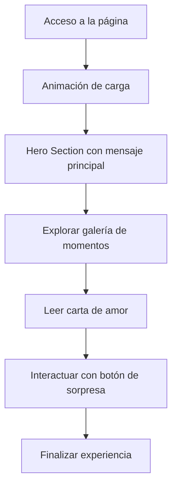

## 1. Product Overview
Página web de cumpleaños personalizada y emotiva para celebrar a la persona amada, con diseño elegante, animaciones suaves y contenido personalizado. El objetivo es crear una experiencia memorable y sincera que se pueda compartir fácilmente.

## 2. Core Features

### 2.1 User Roles
No se requieren roles específicos, la página es para acceso público (con enlace directo).

### 2.2 Feature Module
1. **Página de Inicio**: Hero section con mensaje principal, animaciones de confeti, sección de fotos/momentos, carta de amor, countdown o fecha del cumpleaños, botón interactivo.

### 2.3 Page Details
| Page Name | Module Name | Feature description |
|-----------|-------------|---------------------|
| Página de Inicio | Hero Section | Animación de entrada, texto personalizado, fondo con efecto de gradiente o textura. |
| Página de Inicio | Galería de Momentos | Carrusel o grid de fotos con efectos al pasar el cursor. |
| Página de Inicio | Carta de Amor | Texto emotivo con animación de escritura o fade-in. |
| Página de Inicio | Botón de Sorpresa | Interacción que desencadena confeti, mensaje extra o música. |
| Página de Inicio | Footer | Fecha del cumpleaños y dedicatoria. |

## 3. Core Process
El usuario accede a la página, ve una animación de entrada, explora las secciones, interactúa con el botón de sorpresa y disfruta de la experiencia personalizada.

## 4. User Interface Design
### 4.1 Design Style
- **Colores principales**: Rosado claro (#FFC0CB) y Morado (#9B59B6) como acentos, fondo blanco o crema (#FFF5F5).
- **Botones**: Redondeados, con efecto de elevación al hacer hover.
- **Tipografía**: Great Vibes para títulos (elegante y cursiva), Poppins para texto normal (legible y moderno).
- **Layout**: Vertical, con secciones espaciadas, centrado para focalizar la atención.
- **Íconos**: Lucide React (corazones, regalos, confeti).

### 4.2 Page Design Overview
| Page Name | Module Name | UI Elements |
|-----------|-------------|-------------|
| Página de Inicio | Hero Section | Gradiente suave, texto grande con animación de aparición, íconos flotantes. |
| Página de Inicio | Galería de Momentos | Tarjetas de fotos con sombras, efecto de escala al hover. |
| Página de Inicio | Carta de Amor | Fondo de papel, texto con animación de escritura, íconos decorativos. |
| Página de Inicio | Botón de Sorpresa | Colorido, con pulso animado, confeti al hacer clic. |

### 4.3 Responsiveness
Diseño desktop-first, adaptado a móviles y tabletas con Tailwind CSS, asegurando legibilidad y experiencia fluida en todas las pantallas.
