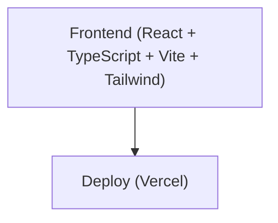

## 1. Architecture Design

## 2. Technology Description
- **Frontend**: React@18 + TypeScript + Vite + Tailwind CSS
- **Librerías adicionales**:
  - `canvas-confetti`: Para animaciones de confeti.
  - `lucide-react`: Para íconos elegantes.
- **Initialization Tool**: vite-init con plantilla `react-ts`
- **Backend**: No es necesario (página estática)
- **Database**: No es necesario

## 3. Route Definitions
| Route | Purpose |
|-------|---------|
| / | Página principal de cumpleaños |

## 4. Data Model
No se requiere modelo de datos (página estática con contenido personalizable en código).
